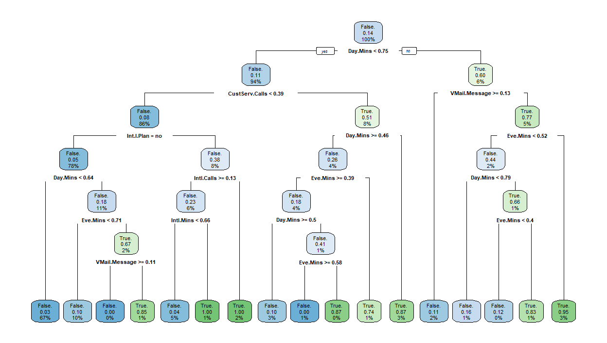

# Data Mining Course Assignments

1.Exploratory Data Analysis: Preprocessing steps such as analyzing barplots, contingency tables, determining correlated attributes, performing hypothesis tests.

2. Regression: Employing linear regression and normality plots.

   
3. KNN: employing KNN model to predict the label of a sample based on its nearest neighbors.

4. Decision Tree: 

5. Nueral Networks:

6. K-Means:

